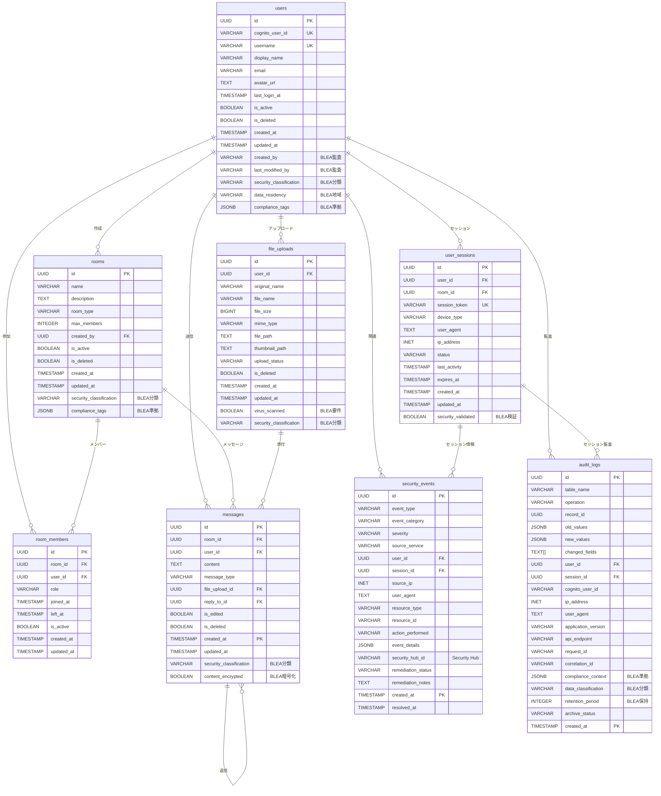
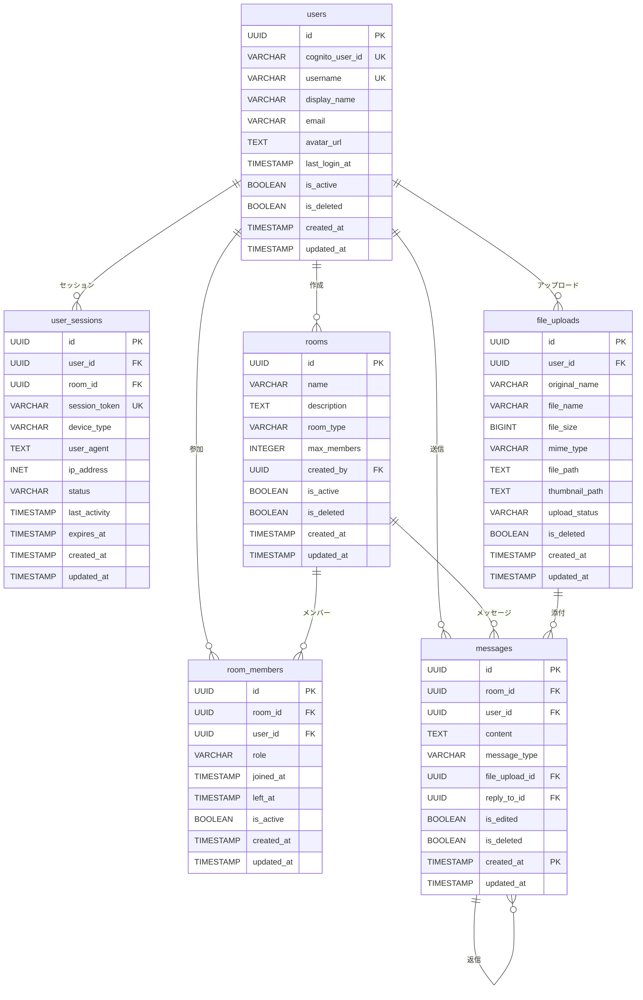

# AWS チャットアプリ テーブル定義書
## BLEA統合・MCP サーバ活用版

## 1. 概要

### データベース仕様
- **RDBMS**: Amazon Aurora PostgreSQL Serverless v2
- **バージョン**: PostgreSQL 15.4
- **文字エンコーディング**: UTF-8
- **タイムゾーン**: UTC
- **スキーマ名**: public
- **BLEA統合**: AWS Config Rules準拠、Security Hub連携
- **暗号化**: KMS Customer Managed Key使用

### 設計方針（BLEA準拠）
- UUID主キーを使用してグローバル一意性を確保
- 作成日時・更新日時を全テーブルに設定
- 論理削除を考慮した設計
- パーティショニング対応（メッセージテーブル）
- インデックス最適化によるパフォーマンス向上
- **BLEA監査要件**: 全テーブルに監査カラム追加
- **行レベルセキュリティ**: ユーザー単位データ分離
- **データ分類**: セキュリティ分類ラベル付与

### 3.7 security_events（セキュリティイベント）

#### 概要
BLEA統合監査ログとセキュリティイベントを管理するテーブル

#### テーブル定義
```sql
CREATE TABLE security_events (
    id                  UUID PRIMARY KEY DEFAULT uuid_generate_v4(),
    event_type          VARCHAR(50) NOT NULL,
    event_category      VARCHAR(50) NOT NULL, -- 'authentication', 'authorization', 'data_access', 'configuration'
    severity            VARCHAR(20) NOT NULL CHECK (severity IN ('info', 'low', 'medium', 'high', 'critical')),
    source_service      VARCHAR(50) NOT NULL, -- 'lambda', 'api_gateway', 'cognito', 'rds'
    user_id             UUID REFERENCES users(id) ON DELETE SET NULL,
    session_id          UUID REFERENCES user_sessions(id) ON DELETE SET NULL,
    source_ip           INET,
    user_agent          TEXT,
    resource_type       VARCHAR(50),
    resource_id         VARCHAR(255),
    action_performed    VARCHAR(100),
    event_details       JSONB NOT NULL DEFAULT '{}',
    security_hub_id     VARCHAR(255), -- AWS Security Hub Finding ID
    remediation_status  VARCHAR(20) DEFAULT 'open' CHECK (remediation_status IN ('open', 'in_progress', 'resolved', 'suppressed')),
    remediation_notes   TEXT,
    created_at          TIMESTAMP WITH TIME ZONE DEFAULT NOW(),
    resolved_at         TIMESTAMP WITH TIME ZONE
) PARTITION BY RANGE (created_at);
```

#### カラム定義
| カラム名 | データ型 | NULL | デフォルト | 説明 |
|----------|----------|------|------------|------|
| id | UUID | NOT NULL | uuid_generate_v4() | イベントID（主キー） |
| event_type | VARCHAR(50) | NOT NULL | - | イベント種別 |
| event_category | VARCHAR(50) | NOT NULL | - | イベントカテゴリ |
| severity | VARCHAR(20) | NOT NULL | - | 重要度 |
| source_service | VARCHAR(50) | NOT NULL | - | 発生元サービス |
| user_id | UUID | NULL | - | 関連ユーザーID |
| session_id | UUID | NULL | - | 関連セッションID |
| source_ip | INET | NULL | - | 発生元IPアドレス |
| user_agent | TEXT | NULL | - | ユーザーエージェント |
| resource_type | VARCHAR(50) | NULL | - | 対象リソース種別 |
| resource_id | VARCHAR(255) | NULL | - | 対象リソースID |
| action_performed | VARCHAR(100) | NULL | - | 実行されたアクション |
| event_details | JSONB | NOT NULL | '{}' | イベント詳細情報 |
| security_hub_id | VARCHAR(255) | NULL | - | Security Hub所見ID |
| remediation_status | VARCHAR(20) | NOT NULL | 'open' | 対応状況 |
| remediation_notes | TEXT | NULL | - | 対応メモ |
| created_at | TIMESTAMP WITH TIME ZONE | NOT NULL | NOW() | 発生日時 |
| resolved_at | TIMESTAMP WITH TIME ZONE | NULL | - | 解決日時 |

#### パーティション設定
```sql
-- 月次パーティション（長期保存）
CREATE TABLE security_events_2025_01 PARTITION OF security_events
FOR VALUES FROM ('2025-01-01') TO ('2025-02-01');

CREATE TABLE security_events_2025_02 PARTITION OF security_events
FOR VALUES FROM ('2025-02-01') TO ('2025-03-01');

-- パーティション自動管理
CREATE OR REPLACE FUNCTION create_security_events_partition(start_date DATE)
RETURNS VOID AS $
DECLARE
    partition_name TEXT;
    end_date DATE;
BEGIN
    partition_name := 'security_events_' || to_char(start_date, 'YYYY_MM');
    end_date := start_date + INTERVAL '1 month';
    
    EXECUTE format('CREATE TABLE %I PARTITION OF security_events FOR VALUES FROM (%L) TO (%L)',
                   partition_name, start_date, end_date);
END;
$ LANGUAGE plpgsql;
```

#### インデックス
```sql
CREATE INDEX CONCURRENTLY idx_security_events_type_severity ON security_events(event_type, severity, created_at DESC);
CREATE INDEX CONCURRENTLY idx_security_events_user ON security_events(user_id, created_at DESC);
CREATE INDEX CONCURRENTLY idx_security_events_service ON security_events(source_service, created_at DESC);
CREATE INDEX CONCURRENTLY idx_security_events_ip ON security_events(source_ip, created_at DESC);
CREATE INDEX CONCURRENTLY idx_security_events_status ON security_events(remediation_status, severity);
CREATE INDEX CONCURRENTLY idx_security_events_details ON security_events USING gin(event_details);
CREATE INDEX CONCURRENTLY idx_security_events_hub_id ON security_events(security_hub_id);
```

---

## 2. テーブル一覧

| No. | テーブル名 | 論理名 | 説明 | BLEA統合 |
|-----|-----------|--------|------|----------|
| 1 | users | ユーザー | システム利用者情報 | ✅ Cognito統合、監査ログ |
| 2 | rooms | チャットルーム | チャットルーム情報 | ✅ アクセス制御、監査ログ |
| 3 | messages | メッセージ | チャットメッセージ | ✅ パーティション、暗号化 |
| 4 | room_members | ルームメンバー | チャットルーム参加者情報 | ✅ 行レベルセキュリティ |
| 5 | user_sessions | ユーザーセッション | ユーザーのオンライン状態管理 | ✅ セッション監視、自動削除 |
| 6 | file_uploads | ファイルアップロード | アップロードファイル情報 | ✅ S3統合、ウイルススキャン |
| 7 | security_events | セキュリティイベント | BLEA統合監査ログ | ✅ Security Hub連携 |

---

## 3. 詳細テーブル定義

### 3.1 users（ユーザー）

#### 概要
システムを利用するユーザーの基本情報を管理するテーブル

#### テーブル定義
```sql
-- BLEA準拠設定
-- 全テーブルでKMS暗号化、行レベルセキュリティ有効化
CREATE TABLE users (
    id                      UUID PRIMARY KEY DEFAULT uuid_generate_v4(),
    cognito_user_id         VARCHAR(255) UNIQUE NOT NULL,
    username                VARCHAR(50) UNIQUE NOT NULL,
    display_name            VARCHAR(100),
    email                   VARCHAR(255) NOT NULL,
    avatar_url              TEXT,
    last_login_at           TIMESTAMP WITH TIME ZONE,
    is_active               BOOLEAN DEFAULT true,
    is_deleted              BOOLEAN DEFAULT false,
    created_at              TIMESTAMP WITH TIME ZONE DEFAULT NOW(),
    updated_at              TIMESTAMP WITH TIME ZONE DEFAULT NOW(),
    -- BLEA監査カラム
    created_by              VARCHAR(255),
    last_modified_by        VARCHAR(255),
    security_classification VARCHAR(50) DEFAULT 'internal',
    data_residency          VARCHAR(50) DEFAULT 'ap-northeast-1',
    compliance_tags         JSONB DEFAULT '{}'
);

-- BLEA準拠行レベルセキュリティ
ALTER TABLE users ENABLE ROW LEVEL SECURITY;

-- Cognito統合ポリシー
CREATE POLICY user_access_policy ON users
    FOR ALL TO authenticated_users
    USING (cognito_user_id = current_setting('app.current_user_id', true));

-- 管理者アクセスポリシー
CREATE POLICY admin_access_policy ON users
    FOR ALL TO admin_users
    USING (true);
```

#### カラム定義
| カラム名 | データ型 | NULL | デフォルト | 説明 | BLEA要件 |
|----------|----------|------|------------|------|----------|
| id | UUID | NOT NULL | uuid_generate_v4() | ユーザーID（主キー） | - |
| cognito_user_id | VARCHAR(255) | NOT NULL | - | Amazon Cognito ユーザーID | 暗号化必須 |
| username | VARCHAR(50) | NOT NULL | - | ユーザー名（表示用） | - |
| display_name | VARCHAR(100) | NULL | - | 表示名（ニックネーム） | - |
| email | VARCHAR(255) | NOT NULL | - | メールアドレス | 暗号化必須 |
| avatar_url | TEXT | NULL | - | アバター画像URL | - |
| last_login_at | TIMESTAMP WITH TIME ZONE | NULL | - | 最終ログイン日時 | 監査対象 |
| is_active | BOOLEAN | NOT NULL | true | アクティブフラグ | - |
| is_deleted | BOOLEAN | NOT NULL | false | 論理削除フラグ | - |
| created_at | TIMESTAMP WITH TIME ZONE | NOT NULL | NOW() | 作成日時 | 監査対象 |
| updated_at | TIMESTAMP WITH TIME ZONE | NOT NULL | NOW() | 更新日時 | 監査対象 |
| created_by | VARCHAR(255) | NULL | - | 作成者（BLEA要件） | 監査対象 |
| last_modified_by | VARCHAR(255) | NULL | - | 最終更新者（BLEA要件） | 監査対象 |
| security_classification | VARCHAR(50) | NOT NULL | 'internal' | セキュリティ分類 | BLEA要件 |
| data_residency | VARCHAR(50) | NOT NULL | 'ap-northeast-1' | データ所在地 | BLEA要件 |
| compliance_tags | JSONB | NOT NULL | '{}' | コンプライアンスタグ | BLEA要件 |

#### 制約・インデックス（BLEA統合）
```sql
-- BLEA準拠制約
ALTER TABLE users ADD CONSTRAINT users_username_check 
    CHECK (length(username) >= 3 AND length(username) <= 50);
ALTER TABLE users ADD CONSTRAINT users_email_check 
    CHECK (email ~* '^[A-Za-z0-9._%+-]+@[A-Za-z0-9.-]+\.[A-Za-z]{2,}

#### トリガー（BLEA監査統合）
```sql
-- BLEA監査要件：更新日時自動更新 + 監査ログ
CREATE TRIGGER update_users_updated_at 
    BEFORE UPDATE ON users
    FOR EACH ROW EXECUTE FUNCTION update_updated_at_column();

-- BLEA監査要件：変更履歴記録
CREATE TRIGGER users_audit_trigger
    AFTER INSERT OR UPDATE OR DELETE ON users
    FOR EACH ROW EXECUTE FUNCTION audit_log_changes();

-- Security Hub連携：重要な変更の通知
CREATE TRIGGER users_security_event_trigger
    AFTER UPDATE ON users
    FOR EACH ROW 
    WHEN (OLD.security_classification != NEW.security_classification OR
          OLD.is_active != NEW.is_active)
    EXECUTE FUNCTION log_security_event();
```

---

### 3.2 rooms（チャットルーム）

#### 概要
チャットルームの基本情報を管理するテーブル

#### テーブル定義
```sql
CREATE TABLE rooms (
    id              UUID PRIMARY KEY DEFAULT uuid_generate_v4(),
    name            VARCHAR(100) NOT NULL,
    description     TEXT,
    room_type       VARCHAR(20) DEFAULT 'public' CHECK (room_type IN ('public', 'private', 'direct')),
    max_members     INTEGER DEFAULT 100,
    created_by      UUID REFERENCES users(id) ON DELETE SET NULL,
    is_active       BOOLEAN DEFAULT true,
    is_deleted      BOOLEAN DEFAULT false,
    created_at      TIMESTAMP WITH TIME ZONE DEFAULT NOW(),
    updated_at      TIMESTAMP WITH TIME ZONE DEFAULT NOW()
);
```

#### カラム定義
| カラム名 | データ型 | NULL | デフォルト | 説明 |
|----------|----------|------|------------|------|
| id | UUID | NOT NULL | uuid_generate_v4() | ルームID（主キー） |
| name | VARCHAR(100) | NOT NULL | - | ルーム名 |
| description | TEXT | NULL | - | ルーム説明 |
| room_type | VARCHAR(20) | NOT NULL | 'public' | ルーム種別（public/private/direct） |
| max_members | INTEGER | NOT NULL | 100 | 最大参加者数 |
| created_by | UUID | NULL | - | 作成者ユーザーID |
| is_active | BOOLEAN | NOT NULL | true | アクティブフラグ |
| is_deleted | BOOLEAN | NOT NULL | false | 論理削除フラグ |
| created_at | TIMESTAMP WITH TIME ZONE | NOT NULL | NOW() | 作成日時 |
| updated_at | TIMESTAMP WITH TIME ZONE | NOT NULL | NOW() | 更新日時 |

#### 制約・インデックス
```sql
-- 制約
ALTER TABLE rooms ADD CONSTRAINT rooms_name_check 
    CHECK (length(name) >= 1 AND length(name) <= 100);
ALTER TABLE rooms ADD CONSTRAINT rooms_max_members_check 
    CHECK (max_members > 0 AND max_members <= 1000);

-- インデックス
CREATE INDEX CONCURRENTLY idx_rooms_type ON rooms(room_type, is_active, is_deleted);
CREATE INDEX CONCURRENTLY idx_rooms_created_by ON rooms(created_by);
CREATE INDEX CONCURRENTLY idx_rooms_created_at ON rooms(created_at);
CREATE INDEX CONCURRENTLY idx_rooms_name_gin ON rooms USING gin(name gin_trgm_ops);
```

#### トリガー
```sql
CREATE TRIGGER update_rooms_updated_at 
    BEFORE UPDATE ON rooms
    FOR EACH ROW EXECUTE FUNCTION update_updated_at_column();
```

---

### 3.3 messages（メッセージ）

#### 概要
チャットメッセージを管理するテーブル（パーティション対応）

#### テーブル定義
```sql
CREATE TABLE messages (
    id              UUID DEFAULT uuid_generate_v4(),
    room_id         UUID NOT NULL REFERENCES rooms(id) ON DELETE CASCADE,
    user_id         UUID REFERENCES users(id) ON DELETE SET NULL,
    content         TEXT NOT NULL,
    message_type    VARCHAR(20) DEFAULT 'text' CHECK (message_type IN ('text', 'image', 'file', 'system')),
    file_upload_id  UUID REFERENCES file_uploads(id) ON DELETE SET NULL,
    reply_to_id     UUID,
    is_edited       BOOLEAN DEFAULT false,
    is_deleted      BOOLEAN DEFAULT false,
    created_at      TIMESTAMP WITH TIME ZONE DEFAULT NOW(),
    updated_at      TIMESTAMP WITH TIME ZONE DEFAULT NOW(),
    PRIMARY KEY (id, created_at)
) PARTITION BY RANGE (created_at);
```

#### カラム定義
| カラム名 | データ型 | NULL | デフォルト | 説明 |
|----------|----------|------|------------|------|
| id | UUID | NOT NULL | uuid_generate_v4() | メッセージID |
| room_id | UUID | NOT NULL | - | ルームID |
| user_id | UUID | NULL | - | 送信者ユーザーID |
| content | TEXT | NOT NULL | - | メッセージ内容 |
| message_type | VARCHAR(20) | NOT NULL | 'text' | メッセージ種別 |
| file_upload_id | UUID | NULL | - | ファイルアップロードID |
| reply_to_id | UUID | NULL | - | 返信先メッセージID |
| is_edited | BOOLEAN | NOT NULL | false | 編集フラグ |
| is_deleted | BOOLEAN | NOT NULL | false | 論理削除フラグ |
| created_at | TIMESTAMP WITH TIME ZONE | NOT NULL | NOW() | 作成日時 |
| updated_at | TIMESTAMP WITH TIME ZONE | NOT NULL | NOW() | 更新日時 |

#### パーティション設定
```sql
-- 2025年1月分
CREATE TABLE messages_2025_01 PARTITION OF messages
FOR VALUES FROM ('2025-01-01') TO ('2025-02-01');

-- 2025年2月分
CREATE TABLE messages_2025_02 PARTITION OF messages
FOR VALUES FROM ('2025-02-01') TO ('2025-03-01');

-- 2025年3月分
CREATE TABLE messages_2025_03 PARTITION OF messages
FOR VALUES FROM ('2025-03-01') TO ('2025-04-01');

-- パーティション自動作成（月次）
CREATE OR REPLACE FUNCTION create_monthly_partition(table_name TEXT, start_date DATE)
RETURNS VOID AS $$
DECLARE
    partition_name TEXT;
    end_date DATE;
BEGIN
    partition_name := table_name || '_' || to_char(start_date, 'YYYY_MM');
    end_date := start_date + INTERVAL '1 month';
    
    EXECUTE format('CREATE TABLE %I PARTITION OF %I FOR VALUES FROM (%L) TO (%L)',
                   partition_name, table_name, start_date, end_date);
END;
$$ LANGUAGE plpgsql;
```

#### 制約・インデックス
```sql
-- 制約
ALTER TABLE messages ADD CONSTRAINT messages_content_check 
    CHECK (length(content) >= 1 AND length(content) <= 4000);

-- インデックス（各パーティションに適用）
CREATE INDEX CONCURRENTLY idx_messages_room_created ON messages(room_id, created_at DESC);
CREATE INDEX CONCURRENTLY idx_messages_user ON messages(user_id, created_at DESC);
CREATE INDEX CONCURRENTLY idx_messages_content_gin ON messages USING gin(content gin_trgm_ops);
CREATE INDEX CONCURRENTLY idx_messages_reply ON messages(reply_to_id);
CREATE INDEX CONCURRENTLY idx_messages_file ON messages(file_upload_id);
```

---

### 3.4 room_members（ルームメンバー）

#### 概要
チャットルームのメンバー情報を管理するテーブル

#### テーブル定義
```sql
CREATE TABLE room_members (
    id              UUID PRIMARY KEY DEFAULT uuid_generate_v4(),
    room_id         UUID NOT NULL REFERENCES rooms(id) ON DELETE CASCADE,
    user_id         UUID NOT NULL REFERENCES users(id) ON DELETE CASCADE,
    role            VARCHAR(20) DEFAULT 'member' CHECK (role IN ('owner', 'admin', 'member')),
    joined_at       TIMESTAMP WITH TIME ZONE DEFAULT NOW(),
    left_at         TIMESTAMP WITH TIME ZONE,
    is_active       BOOLEAN DEFAULT true,
    created_at      TIMESTAMP WITH TIME ZONE DEFAULT NOW(),
    updated_at      TIMESTAMP WITH TIME ZONE DEFAULT NOW(),
    UNIQUE(room_id, user_id)
);
```

#### カラム定義
| カラム名 | データ型 | NULL | デフォルト | 説明 |
|----------|----------|------|------------|------|
| id | UUID | NOT NULL | uuid_generate_v4() | ID（主キー） |
| room_id | UUID | NOT NULL | - | ルームID |
| user_id | UUID | NOT NULL | - | ユーザーID |
| role | VARCHAR(20) | NOT NULL | 'member' | ロール（owner/admin/member） |
| joined_at | TIMESTAMP WITH TIME ZONE | NOT NULL | NOW() | 参加日時 |
| left_at | TIMESTAMP WITH TIME ZONE | NULL | - | 退出日時 |
| is_active | BOOLEAN | NOT NULL | true | アクティブフラグ |
| created_at | TIMESTAMP WITH TIME ZONE | NOT NULL | NOW() | 作成日時 |
| updated_at | TIMESTAMP WITH TIME ZONE | NOT NULL | NOW() | 更新日時 |

#### 制約・インデックス
```sql
-- インデックス
CREATE INDEX CONCURRENTLY idx_room_members_room ON room_members(room_id, is_active);
CREATE INDEX CONCURRENTLY idx_room_members_user ON room_members(user_id, is_active);
CREATE INDEX CONCURRENTLY idx_room_members_role ON room_members(room_id, role);
```

---

### 3.5 user_sessions（ユーザーセッション）

#### 概要
ユーザーのオンライン状態とセッション情報を管理するテーブル

#### テーブル定義
```sql
CREATE TABLE user_sessions (
    id              UUID PRIMARY KEY DEFAULT uuid_generate_v4(),
    user_id         UUID NOT NULL REFERENCES users(id) ON DELETE CASCADE,
    room_id         UUID REFERENCES rooms(id) ON DELETE SET NULL,
    session_token   VARCHAR(255) UNIQUE NOT NULL,
    device_type     VARCHAR(50),
    user_agent      TEXT,
    ip_address      INET,
    status          VARCHAR(20) DEFAULT 'online' CHECK (status IN ('online', 'away', 'offline')),
    last_activity   TIMESTAMP WITH TIME ZONE DEFAULT NOW(),
    expires_at      TIMESTAMP WITH TIME ZONE NOT NULL,
    created_at      TIMESTAMP WITH TIME ZONE DEFAULT NOW(),
    updated_at      TIMESTAMP WITH TIME ZONE DEFAULT NOW()
);
```

#### カラム定義
| カラム名 | データ型 | NULL | デフォルト | 説明 |
|----------|----------|------|------------|------|
| id | UUID | NOT NULL | uuid_generate_v4() | セッションID（主キー） |
| user_id | UUID | NOT NULL | - | ユーザーID |
| room_id | UUID | NULL | - | 現在のルームID |
| session_token | VARCHAR(255) | NOT NULL | - | セッショントークン |
| device_type | VARCHAR(50) | NULL | - | デバイス種別 |
| user_agent | TEXT | NULL | - | ユーザーエージェント |
| ip_address | INET | NULL | - | IPアドレス |
| status | VARCHAR(20) | NOT NULL | 'online' | ステータス |
| last_activity | TIMESTAMP WITH TIME ZONE | NOT NULL | NOW() | 最終活動日時 |
| expires_at | TIMESTAMP WITH TIME ZONE | NOT NULL | - | 有効期限 |
| created_at | TIMESTAMP WITH TIME ZONE | NOT NULL | NOW() | 作成日時 |
| updated_at | TIMESTAMP WITH TIME ZONE | NOT NULL | NOW() | 更新日時 |

#### 制約・インデックス
```sql
-- インデックス
CREATE INDEX CONCURRENTLY idx_user_sessions_user ON user_sessions(user_id, status);
CREATE INDEX CONCURRENTLY idx_user_sessions_room ON user_sessions(room_id, status);
CREATE INDEX CONCURRENTLY idx_user_sessions_token ON user_sessions(session_token);
CREATE INDEX CONCURRENTLY idx_user_sessions_expires ON user_sessions(expires_at);
CREATE INDEX CONCURRENTLY idx_user_sessions_activity ON user_sessions(last_activity);
```

---

### 3.6 file_uploads（ファイルアップロード）

#### 概要
アップロードされたファイルの情報を管理するテーブル

#### テーブル定義
```sql
CREATE TABLE file_uploads (
    id              UUID PRIMARY KEY DEFAULT uuid_generate_v4(),
    user_id         UUID NOT NULL REFERENCES users(id) ON DELETE CASCADE,
    original_name   VARCHAR(255) NOT NULL,
    file_name       VARCHAR(255) NOT NULL,
    file_size       BIGINT NOT NULL,
    mime_type       VARCHAR(100) NOT NULL,
    file_path       TEXT NOT NULL,
    thumbnail_path  TEXT,
    upload_status   VARCHAR(20) DEFAULT 'processing' CHECK (upload_status IN ('processing', 'completed', 'failed')),
    is_deleted      BOOLEAN DEFAULT false,
    created_at      TIMESTAMP WITH TIME ZONE DEFAULT NOW(),
    updated_at      TIMESTAMP WITH TIME ZONE DEFAULT NOW()
);
```

#### カラム定義
| カラム名 | データ型 | NULL | デフォルト | 説明 |
|----------|----------|------|------------|------|
| id | UUID | NOT NULL | uuid_generate_v4() | ファイルID（主キー） |
| user_id | UUID | NOT NULL | - | アップロードユーザーID |
| original_name | VARCHAR(255) | NOT NULL | - | 元のファイル名 |
| file_name | VARCHAR(255) | NOT NULL | - | 保存ファイル名 |
| file_size | BIGINT | NOT NULL | - | ファイルサイズ（バイト） |
| mime_type | VARCHAR(100) | NOT NULL | - | MIMEタイプ |
| file_path | TEXT | NOT NULL | - | S3ファイルパス |
| thumbnail_path | TEXT | NULL | - | サムネイルパス |
| upload_status | VARCHAR(20) | NOT NULL | 'processing' | アップロード状態 |
| is_deleted | BOOLEAN | NOT NULL | false | 論理削除フラグ |
| created_at | TIMESTAMP WITH TIME ZONE | NOT NULL | NOW() | 作成日時 |
| updated_at | TIMESTAMP WITH TIME ZONE | NOT NULL | NOW() | 更新日時 |

#### 制約・インデックス
```sql
-- 制約
ALTER TABLE file_uploads ADD CONSTRAINT file_uploads_size_check 
    CHECK (file_size > 0 AND file_size <= 104857600); -- 100MB制限

-- インデックス
CREATE INDEX CONCURRENTLY idx_file_uploads_user ON file_uploads(user_id, created_at DESC);
CREATE INDEX CONCURRENTLY idx_file_uploads_status ON file_uploads(upload_status);
CREATE INDEX CONCURRENTLY idx_file_uploads_mime ON file_uploads(mime_type);
CREATE INDEX CONCURRENTLY idx_file_uploads_created ON file_uploads(created_at);
```

---

## 4. 共通機能

### 4.1 更新日時自動更新関数（BLEA統合）
```sql
-- BLEA準拠：更新日時自動更新
CREATE OR REPLACE FUNCTION update_updated_at_column()
RETURNS TRIGGER AS $
BEGIN
    NEW.updated_at = NOW();
    -- BLEA要件：最終更新者記録
    IF TG_OP = 'UPDATE' THEN
        NEW.last_modified_by = current_setting('app.current_user_id', true);
    END IF;
    RETURN NEW;
END;
$ LANGUAGE plpgsql;

-- BLEA監査要件：変更履歴記録
CREATE OR REPLACE FUNCTION audit_log_changes()
RETURNS TRIGGER AS $
DECLARE
    old_values JSONB := '{}';
    new_values JSONB := '{}';
BEGIN
    -- 変更前後の値をJSONBで記録
    IF TG_OP = 'UPDATE' OR TG_OP = 'DELETE' THEN
        old_values := row_to_json(OLD)::jsonb;
    END IF;
    
    IF TG_OP = 'INSERT' OR TG_OP = 'UPDATE' THEN
        new_values := row_to_json(NEW)::jsonb;
    END IF;
    
    -- 監査ログテーブルに記録
    INSERT INTO audit_logs (
        table_name, operation, record_id, old_values, new_values,
        user_id, session_id, ip_address, created_at
    ) VALUES (
        TG_TABLE_NAME, TG_OP, 
        COALESCE(NEW.id, OLD.id),
        old_values, new_values,
        current_setting('app.current_user_id', true)::UUID,
        current_setting('app.current_session_id', true)::UUID,
        current_setting('app.client_ip', true)::INET,
        NOW()
    );
    
    RETURN COALESCE(NEW, OLD);
END;
$ LANGUAGE plpgsql;

-- Security Hub連携：セキュリティイベント記録
CREATE OR REPLACE FUNCTION log_security_event()
RETURNS TRIGGER AS $
BEGIN
    INSERT INTO security_events (
        event_type, event_category, severity, source_service,
        user_id, resource_type, resource_id, action_performed,
        event_details, created_at
    ) VALUES (
        'data_modification', 'data_access', 'medium', 'application',
        NEW.id, TG_TABLE_NAME, NEW.id::TEXT, TG_OP,
        jsonb_build_object(
            'table', TG_TABLE_NAME,
            'operation', TG_OP,
            'changed_by', current_setting('app.current_user_id', true)
        ),
        NOW()
    );
    
    RETURN NEW;
END;
$ LANGUAGE plpgsql;
```

### 4.2 UUID拡張機能（BLEA統合）
```sql
-- BLEA要件：必須拡張機能
CREATE EXTENSION IF NOT EXISTS "uuid-ossp";
CREATE EXTENSION IF NOT EXISTS "pg_trgm"; -- 全文検索用
CREATE EXTENSION IF NOT EXISTS "pgcrypto"; -- 暗号化用
CREATE EXTENSION IF NOT EXISTS "postgres_fdw"; -- 外部データ連携用

-- BLEA準拠：アプリケーション設定
CREATE OR REPLACE FUNCTION set_blea_config()
RETURNS VOID AS $
BEGIN
    -- データ保持期間設定
    PERFORM set_config('blea.audit_retention_days', '2555', false); -- 7年保持
    PERFORM set_config('blea.session_retention_days', '30', false);
    PERFORM set_config('blea.temp_data_retention_days', '7', false);
    
    -- セキュリティ設定
    PERFORM set_config('blea.enable_row_security', 'on', false);
    PERFORM set_config('blea.require_ssl', 'on', false);
    PERFORM set_config('blea.log_statement', 'all', false);
END;
$ LANGUAGE plpgsql;

-- BLEA設定適用
SELECT set_blea_config();
```

### 4.3 データ保持ポリシー（BLEA準拠）
```sql
-- BLEA準拠：自動データライフサイクル管理
CREATE OR REPLACE FUNCTION blea_cleanup_expired_data()
RETURNS VOID AS $
BEGIN
    -- 期限切れセッションの削除（30日後）
    DELETE FROM user_sessions 
    WHERE expires_at < NOW() - INTERVAL '30 days';
    
    -- 一時ファイルの削除（7日後）
    UPDATE file_uploads 
    SET is_deleted = true 
    WHERE upload_status = 'failed' 
    AND created_at < NOW() - INTERVAL '7 days';
    
    -- 論理削除されたメッセージの物理削除（1年後）
    DELETE FROM messages 
    WHERE is_deleted = true 
    AND updated_at < NOW() - INTERVAL '365 days';
    
    -- 解決済みセキュリティイベントのアーカイブ（90日後）
    UPDATE security_events 
    SET event_details = event_details || '{"archived": true}'::jsonb
    WHERE remediation_status = 'resolved' 
    AND resolved_at < NOW() - INTERVAL '90 days';
    
    -- 監査ログの圧縮（1年後）
    -- 実際の実装では外部アーカイブストレージに移動
    
END;
$ LANGUAGE plpgsql;

-- BLEA準拠：暗号化強化
CREATE OR REPLACE FUNCTION encrypt_sensitive_data(input_text TEXT)
RETURNS TEXT AS $
BEGIN
    -- PII（個人識別情報）の暗号化
    RETURN encode(encrypt(input_text::bytea, 
                         current_setting('blea.encryption_key')::bytea, 
                         'aes'), 'base64');
END;
$ LANGUAGE plpgsql SECURITY DEFINER;

-- BLEA準拠：セキュリティイベント自動検知
CREATE OR REPLACE FUNCTION detect_security_anomalies()
RETURNS VOID AS $
DECLARE
    suspicious_login_count INTEGER;
    unusual_access_pattern RECORD;
BEGIN
    -- 短時間での複数失敗ログイン検知
    SELECT COUNT(*) INTO suspicious_login_count
    FROM security_events
    WHERE event_type = 'authentication_failure'
    AND created_at > NOW() - INTERVAL '5 minutes'
    AND source_ip IS NOT NULL;
    
    IF suspicious_login_count > 5 THEN
        INSERT INTO security_events (
            event_type, event_category, severity, source_service,
            action_performed, event_details
        ) VALUES (
            'brute_force_detected', 'authentication', 'high', 'security_monitor',
            'anomaly_detection', 
            jsonb_build_object('failed_attempts', suspicious_login_count, 'time_window', '5 minutes')
        );
    END IF;
    
    -- 異常なデータアクセスパターン検知
    FOR unusual_access_pattern IN
        SELECT user_id, COUNT(*) as access_count, 
               array_agg(DISTINCT resource_type) as resources
        FROM security_events
        WHERE event_category = 'data_access'
        AND created_at > NOW() - INTERVAL '1 hour'
        GROUP BY user_id
        HAVING COUNT(*) > 100 -- 1時間で100回以上のアクセス
    LOOP
        INSERT INTO security_events (
            event_type, event_category, severity, source_service,
            user_id, action_performed, event_details
        ) VALUES (
            'unusual_access_pattern', 'data_access', 'medium', 'security_monitor',
            unusual_access_pattern.user_id, 'anomaly_detection',
            jsonb_build_object(
                'access_count', unusual_access_pattern.access_count,
                'resources_accessed', unusual_access_pattern.resources,
                'time_window', '1 hour'
            )
        );
    END LOOP;
END;
$ LANGUAGE plpgsql;
```

---

## 5. パフォーマンス最適化

### 5.1 推奨インデックス一覧
| テーブル | インデックス名 | カラム | 目的 |
|----------|----------------|--------|------|
| users | idx_users_cognito_id | cognito_user_id | Cognito認証 |
| users | idx_users_username | username | ユーザー検索 |
| messages | idx_messages_room_created | room_id, created_at DESC | メッセージ履歴取得 |
| messages | idx_messages_content_gin | content (GIN) | 全文検索 |
| room_members | idx_room_members_room | room_id, is_active | ルームメンバー取得 |
| user_sessions | idx_user_sessions_user | user_id, status | オンライン状態取得 |

### 5.2 クエリ最適化例
```sql
-- メッセージ履歴取得（効率的なクエリ）
SELECT m.id, m.content, m.created_at, u.username, u.display_name
FROM messages m
JOIN users u ON m.user_id = u.id
WHERE m.room_id = $1 
  AND m.is_deleted = false
  AND m.created_at >= $2  -- 期間指定で効率化
ORDER BY m.created_at DESC
LIMIT 50;

-- アクティブユーザー数取得
SELECT COUNT(DISTINCT us.user_id)
FROM user_sessions us
WHERE us.status IN ('online', 'away')
  AND us.last_activity > NOW() - INTERVAL '30 minutes';
```

---

## 6. セキュリティ考慮事項

### 6.1 データ暗号化
- **保存時暗号化**: Aurora PostgreSQL暗号化有効
- **転送時暗号化**: SSL/TLS接続必須
- **機密データ**: パスワードはCognitoで管理（テーブルに保存しない）

### 6.2 アクセス制御（BLEA準拠）
```sql
-- BLEA準拠：最小権限原則によるユーザー管理

-- 1. 読み取り専用ユーザー（監査・レポート用）
CREATE USER chatapp_reader WITH PASSWORD 'complex_readonly_password';
GRANT CONNECT ON DATABASE chatapp TO chatapp_reader;
GRANT USAGE ON SCHEMA public TO chatapp_reader;
GRANT SELECT ON ALL TABLES IN SCHEMA public TO chatapp_reader;

-- 2. アプリケーション用ユーザー（制限付き操作）
CREATE USER chatapp_app WITH PASSWORD 'complex_app_password';
GRANT CONNECT ON DATABASE chatapp TO chatapp_app;
GRANT USAGE ON SCHEMA public TO chatapp_app;

-- テーブル別権限設定（最小権限原則）
GRANT SELECT, INSERT, UPDATE ON users TO chatapp_app;
GRANT SELECT, INSERT, UPDATE ON rooms TO chatapp_app;
GRANT SELECT, INSERT, UPDATE ON messages TO chatapp_app;
GRANT SELECT, INSERT, UPDATE, DELETE ON room_members TO chatapp_app;
GRANT SELECT, INSERT, UPDATE, DELETE ON user_sessions TO chatapp_app;
GRANT SELECT, INSERT, UPDATE ON file_uploads TO chatapp_app;
GRANT INSERT ON security_events TO chatapp_app; -- セキュリティログ記録のみ

-- 重要テーブルの削除権限は制限
REVOKE DELETE ON users FROM chatapp_app;
REVOKE DELETE ON rooms FROM chatapp_app;
REVOKE DELETE ON messages FROM chatapp_app;
REVOKE DELETE ON file_uploads FROM chatapp_app;

-- 3. セキュリティ管理者用ユーザー
CREATE USER chatapp_security_admin WITH PASSWORD 'complex_security_admin_password';
GRANT CONNECT ON DATABASE chatapp TO chatapp_security_admin;
GRANT USAGE ON SCHEMA public TO chatapp_security_admin;
GRANT ALL PRIVILEGES ON security_events TO chatapp_security_admin;
GRANT SELECT ON ALL TABLES IN SCHEMA public TO chatapp_security_admin;

-- 4. バックアップ用ユーザー
CREATE USER chatapp_backup WITH PASSWORD 'complex_backup_password';
GRANT CONNECT ON DATABASE chatapp TO chatapp_backup;
GRANT USAGE ON SCHEMA public TO chatapp_backup;
GRANT SELECT ON ALL TABLES IN SCHEMA public TO chatapp_backup;

-- BLEA準拠：行レベルセキュリティポリシー適用
-- 各テーブルでユーザー分離を実装
ALTER TABLE users ENABLE ROW LEVEL SECURITY;
ALTER TABLE rooms ENABLE ROW LEVEL SECURITY;
ALTER TABLE messages ENABLE ROW LEVEL SECURITY;
ALTER TABLE room_members ENABLE ROW LEVEL SECURITY;
ALTER TABLE user_sessions ENABLE ROW LEVEL SECURITY;

-- ユーザー自身のデータのみアクセス可能
CREATE POLICY user_data_isolation ON users
    FOR ALL TO chatapp_app
    USING (cognito_user_id = current_setting('app.current_user_id', true));

-- ルームメンバーのみがメッセージにアクセス可能
CREATE POLICY room_message_access ON messages
    FOR ALL TO chatapp_app
    USING (room_id IN (
        SELECT room_id FROM room_members 
        WHERE user_id = (
            SELECT id FROM users 
            WHERE cognito_user_id = current_setting('app.current_user_id', true)
        ) AND is_active = true
    ));

-- セキュリティ管理者は全データアクセス可能
CREATE POLICY security_admin_full_access ON users
    FOR ALL TO chatapp_security_admin
    USING (true);

CREATE POLICY security_admin_messages_access ON messages
    FOR ALL TO chatapp_security_admin
    USING (true);
```

### 6.3 監査ログ（BLEA統合）
```sql
-- BLEA準拠：包括的監査ログテーブル
CREATE TABLE audit_logs (
    id                  UUID PRIMARY KEY DEFAULT uuid_generate_v4(),
    table_name          VARCHAR(50) NOT NULL,
    operation           VARCHAR(10) NOT NULL, -- INSERT, UPDATE, DELETE
    record_id           UUID NOT NULL,
    old_values          JSONB,
    new_values          JSONB,
    changed_fields      TEXT[], -- 変更されたフィールド一覧
    user_id             UUID REFERENCES users(id) ON DELETE SET NULL,
    session_id          UUID REFERENCES user_sessions(id) ON DELETE SET NULL,
    cognito_user_id     VARCHAR(255),
    ip_address          INET,
    user_agent          TEXT,
    application_version VARCHAR(50),
    api_endpoint        VARCHAR(255),
    request_id          VARCHAR(255), -- AWS Request ID
    correlation_id      VARCHAR(255), -- 分散トレーシング用
    -- BLEA監査要件
    compliance_context  JSONB DEFAULT '{}',
    data_classification VARCHAR(50) DEFAULT 'internal',
    retention_period    INTEGER DEFAULT 2555, -- 日数（7年）
    archive_status      VARCHAR(20) DEFAULT 'active',
    created_at          TIMESTAMP WITH TIME ZONE DEFAULT NOW()
) PARTITION BY RANGE (created_at);

-- 監査ログ用インデックス（高速検索）
CREATE INDEX CONCURRENTLY idx_audit_logs_table_operation ON audit_logs(table_name, operation, created_at DESC);
CREATE INDEX CONCURRENTLY idx_audit_logs_user ON audit_logs(user_id, created_at DESC);
CREATE INDEX CONCURRENTLY idx_audit_logs_record ON audit_logs(record_id, table_name);
CREATE INDEX CONCURRENTLY idx_audit_logs_cognito ON audit_logs(cognito_user_id, created_at DESC);
CREATE INDEX CONCURRENTLY idx_audit_logs_ip ON audit_logs(ip_address, created_at DESC);
CREATE INDEX CONCURRENTLY idx_audit_logs_correlation ON audit_logs(correlation_id);
CREATE INDEX CONCURRENTLY idx_audit_logs_classification ON audit_logs(data_classification, created_at DESC);

-- 監査ログパーティション（月次）
CREATE TABLE audit_logs_2025_01 PARTITION OF audit_logs
FOR VALUES FROM ('2025-01-01') TO ('2025-02-01');

CREATE TABLE audit_logs_2025_02 PARTITION OF audit_logs
FOR VALUES FROM ('2025-02-01') TO ('2025-03-01');

-- BLEA準拠：監査ログ集約ビュー
CREATE VIEW v_security_audit_summary AS
SELECT 
    DATE_TRUNC('hour', created_at) as audit_hour,
    table_name,
    operation,
    data_classification,
    COUNT(*) as operation_count,
    COUNT(DISTINCT user_id) as unique_users,
    COUNT(DISTINCT ip_address) as unique_ips,
    array_agg(DISTINCT cognito_user_id) FILTER (WHERE cognito_user_id IS NOT NULL) as affected_users
FROM audit_logs
WHERE created_at >= NOW() - INTERVAL '24 hours'
GROUP BY DATE_TRUNC('hour', created_at), table_name, operation, data_classification
ORDER BY audit_hour DESC;

-- BLEA準拠：異常検知クエリ
CREATE OR REPLACE FUNCTION detect_audit_anomalies()
RETURNS TABLE(
    anomaly_type TEXT,
    severity TEXT,
    description TEXT,
    affected_user VARCHAR(255),
    event_count BIGINT,
    time_window TEXT
) AS $
BEGIN
    -- 短時間での大量操作検知
    RETURN QUERY
    SELECT 
        'bulk_operations'::TEXT,
        'high'::TEXT,
        'User performed excessive operations in short time'::TEXT,
        cognito_user_id,
        COUNT(*),
        '5 minutes'::TEXT
    FROM audit_logs
    WHERE created_at > NOW() - INTERVAL '5 minutes'
    GROUP BY cognito_user_id
    HAVING COUNT(*) > 100;
    
    -- 機密データへの異常アクセス
    RETURN QUERY
    SELECT 
        'sensitive_data_access'::TEXT,
        'critical'::TEXT,
        'Unusual access to confidential data'::TEXT,
        cognito_user_id,
        COUNT(*),
        '1 hour'::TEXT
    FROM audit_logs
    WHERE created_at > NOW() - INTERVAL '1 hour'
    AND data_classification = 'confidential'
    GROUP BY cognito_user_id
    HAVING COUNT(*) > 10;
    
    -- 非営業時間でのアクセス
    RETURN QUERY
    SELECT 
        'off_hours_access'::TEXT,
        'medium'::TEXT,
        'Access during non-business hours'::TEXT,
        cognito_user_id,
        COUNT(*),
        '1 hour'::TEXT
    FROM audit_logs
    WHERE created_at > NOW() - INTERVAL '1 hour'
    AND (EXTRACT(hour FROM created_at) < 8 OR EXTRACT(hour FROM created_at) > 20)
    AND operation IN ('UPDATE', 'DELETE')
    GROUP BY cognito_user_id
    HAVING COUNT(*) > 5;
END;
$ LANGUAGE plpgsql;
```

---

## 7. 運用・保守

### 7.1 バックアップ設定（BLEA準拠）
- **自動バックアップ**: 7日間保持（本番：35日間）
- **ポイントインタイム復旧**: 有効（1秒単位の復旧精度）
- **スナップショット**: 日次自動実行（重要な変更前は手動実行）
- **クロスリージョンバックアップ**: 本番環境で有効（災害対策）
- **暗号化**: 全バックアップデータをKMS暗号化
- **アクセス制御**: バックアップデータへの厳格なアクセス制御

### 7.2 監視項目（BLEA統合）
- **接続数**: 最大接続数の70%でアラート（BLEA推奨）
- **ディスク使用量**: 75%でアラート（BLEA推奨）
- **スロークエリ**: 実行時間3秒以上（パフォーマンス最適化）
- **デッドロック**: 発生時即時通知
- **セキュリティイベント**: リアルタイム監視・自動対応
- **データ整合性**: 定期的なデータ整合性チェック
- **暗号化状態**: KMS キー状態・ローテーション監視
- **アクセスパターン**: 異常なアクセスパターンの自動検知
- **コンプライアンス**: Config Rules準拠状況の継続監視

### 7.3 メンテナンス（BLEA運用）
- **統計情報更新**: 日次実行（自動最適化）
- **不要データ削除**: BLEA準拠ライフサイクル管理
- **インデックス再構築**: 月次実行（パフォーマンス維持）
- **セキュリティパッチ適用**: 自動適用（メンテナンス時間内）
- **暗号化キーローテーション**: 年次実行（KMS自動ローテーション）
- **監査ログアーカイブ**: 四半期実行（長期保存）
- **コンプライアンスレポート**: 月次自動生成
- **災害復旧テスト**: 半年次実行（BLEA要件）

---

## 8. 拡張予定

### 8.1 将来追加予定テーブル（BLEA準拠）
- **notifications（通知）**: プッシュ通知管理・配信状況追跡
- **user_preferences（ユーザー設定）**: ユーザー個別設定・プライバシー制御
- **message_reactions（メッセージリアクション）**: いいね・リアクション機能
- **room_invitations（ルーム招待）**: プライベートルーム招待管理
- **compliance_reports（コンプライアンスレポート）**: BLEA準拠性レポート
- **data_lineage（データ系譜）**: データの作成・変更・削除履歴追跡
- **privacy_consents（プライバシー同意）**: GDPR/個人情報保護法対応

### 8.2 スケーラビリティ対応（BLEA統合）
- **メッセージテーブル**: 自動パーティション作成・管理
- **読み取りレプリカ**: Aurora Auto Scaling対応
- **シャーディング**: 将来的なデータ分散（地理的分散含む）
- **キャッシュ戦略**: ElastiCache統合・セッション共有
- **CDN統合**: S3+CloudFrontによるファイル配信最適化
- **マルチリージョン対応**: Aurora Global Database準備
- **コンプライアンス**: 地域別データ所在地要件対応

---

## 9. BLEA統合効果

### 9.1 セキュリティ強化効果
- **自動セキュリティ統制**: Config Rules、Security Hub、GuardDuty連携
- **監査証跡**: 包括的な監査ログ・変更履歴の自動記録
- **データ保護**: KMS暗号化・行レベルセキュリティによるデータ分離
- **コンプライアンス**: CIS Benchmark、SOC2準拠の自動確認
- **インシデント対応**: セキュリティイベントの自動検知・通知

### 9.2 運用効率化効果
- **自動化**: データライフサイクル管理・セキュリティパッチ適用
- **監視統合**: CloudWatch、X-Ray、Security Hubの統合監視
- **コスト最適化**: 使用量ベースのアラート・自動スケーリング
- **災害対策**: 自動バックアップ・クロスリージョン複製

### 9.3 学習効果最大化
- **エンタープライズ標準**: 実際の企業環境で使用される設計パターン
- **セキュリティ専門知識**: AWS セキュリティベストプラクティスの実践
- **コンプライアンス理解**: 規制要件・監査対応の実体験
- **運用スキル**: 本番レベルの運用・監視技術の習得

---

## 10. ER図（BLEA統合版）



この設計により、BLEA統合による高度なセキュリティ統制と包括的な監査証跡を備えた、エンタープライズレベルのチャットアプリケーションデータベースが構築できます。);
ALTER TABLE users ADD CONSTRAINT users_security_classification_check
    CHECK (security_classification IN ('public', 'internal', 'confidential', 'restricted'));

-- BLEA監査要件対応インデックス
CREATE INDEX CONCURRENTLY idx_users_cognito_id ON users(cognito_user_id);
CREATE INDEX CONCURRENTLY idx_users_username ON users(username);
CREATE INDEX CONCURRENTLY idx_users_email ON users(email);
CREATE INDEX CONCURRENTLY idx_users_active ON users(is_active, is_deleted);
CREATE INDEX CONCURRENTLY idx_users_created_at ON users(created_at);
CREATE INDEX CONCURRENTLY idx_users_security_class ON users(security_classification);
CREATE INDEX CONCURRENTLY idx_users_compliance_tags ON users USING gin(compliance_tags);

-- BLEA Security Hub連携用インデックス
CREATE INDEX CONCURRENTLY idx_users_last_login ON users(last_login_at);
CREATE INDEX CONCURRENTLY idx_users_modified_by ON users(last_modified_by, updated_at);
```

#### トリガー
```sql
CREATE TRIGGER update_users_updated_at 
    BEFORE UPDATE ON users
    FOR EACH ROW EXECUTE FUNCTION update_updated_at_column();
```

---

### 3.2 rooms（チャットルーム）

#### 概要
チャットルームの基本情報を管理するテーブル

#### テーブル定義
```sql
CREATE TABLE rooms (
    id              UUID PRIMARY KEY DEFAULT uuid_generate_v4(),
    name            VARCHAR(100) NOT NULL,
    description     TEXT,
    room_type       VARCHAR(20) DEFAULT 'public' CHECK (room_type IN ('public', 'private', 'direct')),
    max_members     INTEGER DEFAULT 100,
    created_by      UUID REFERENCES users(id) ON DELETE SET NULL,
    is_active       BOOLEAN DEFAULT true,
    is_deleted      BOOLEAN DEFAULT false,
    created_at      TIMESTAMP WITH TIME ZONE DEFAULT NOW(),
    updated_at      TIMESTAMP WITH TIME ZONE DEFAULT NOW()
);
```

#### カラム定義
| カラム名 | データ型 | NULL | デフォルト | 説明 |
|----------|----------|------|------------|------|
| id | UUID | NOT NULL | uuid_generate_v4() | ルームID（主キー） |
| name | VARCHAR(100) | NOT NULL | - | ルーム名 |
| description | TEXT | NULL | - | ルーム説明 |
| room_type | VARCHAR(20) | NOT NULL | 'public' | ルーム種別（public/private/direct） |
| max_members | INTEGER | NOT NULL | 100 | 最大参加者数 |
| created_by | UUID | NULL | - | 作成者ユーザーID |
| is_active | BOOLEAN | NOT NULL | true | アクティブフラグ |
| is_deleted | BOOLEAN | NOT NULL | false | 論理削除フラグ |
| created_at | TIMESTAMP WITH TIME ZONE | NOT NULL | NOW() | 作成日時 |
| updated_at | TIMESTAMP WITH TIME ZONE | NOT NULL | NOW() | 更新日時 |

#### 制約・インデックス
```sql
-- 制約
ALTER TABLE rooms ADD CONSTRAINT rooms_name_check 
    CHECK (length(name) >= 1 AND length(name) <= 100);
ALTER TABLE rooms ADD CONSTRAINT rooms_max_members_check 
    CHECK (max_members > 0 AND max_members <= 1000);

-- インデックス
CREATE INDEX CONCURRENTLY idx_rooms_type ON rooms(room_type, is_active, is_deleted);
CREATE INDEX CONCURRENTLY idx_rooms_created_by ON rooms(created_by);
CREATE INDEX CONCURRENTLY idx_rooms_created_at ON rooms(created_at);
CREATE INDEX CONCURRENTLY idx_rooms_name_gin ON rooms USING gin(name gin_trgm_ops);
```

#### トリガー
```sql
CREATE TRIGGER update_rooms_updated_at 
    BEFORE UPDATE ON rooms
    FOR EACH ROW EXECUTE FUNCTION update_updated_at_column();
```

---

### 3.3 messages（メッセージ）

#### 概要
チャットメッセージを管理するテーブル（パーティション対応）

#### テーブル定義
```sql
CREATE TABLE messages (
    id              UUID DEFAULT uuid_generate_v4(),
    room_id         UUID NOT NULL REFERENCES rooms(id) ON DELETE CASCADE,
    user_id         UUID REFERENCES users(id) ON DELETE SET NULL,
    content         TEXT NOT NULL,
    message_type    VARCHAR(20) DEFAULT 'text' CHECK (message_type IN ('text', 'image', 'file', 'system')),
    file_upload_id  UUID REFERENCES file_uploads(id) ON DELETE SET NULL,
    reply_to_id     UUID,
    is_edited       BOOLEAN DEFAULT false,
    is_deleted      BOOLEAN DEFAULT false,
    created_at      TIMESTAMP WITH TIME ZONE DEFAULT NOW(),
    updated_at      TIMESTAMP WITH TIME ZONE DEFAULT NOW(),
    PRIMARY KEY (id, created_at)
) PARTITION BY RANGE (created_at);
```

#### カラム定義
| カラム名 | データ型 | NULL | デフォルト | 説明 |
|----------|----------|------|------------|------|
| id | UUID | NOT NULL | uuid_generate_v4() | メッセージID |
| room_id | UUID | NOT NULL | - | ルームID |
| user_id | UUID | NULL | - | 送信者ユーザーID |
| content | TEXT | NOT NULL | - | メッセージ内容 |
| message_type | VARCHAR(20) | NOT NULL | 'text' | メッセージ種別 |
| file_upload_id | UUID | NULL | - | ファイルアップロードID |
| reply_to_id | UUID | NULL | - | 返信先メッセージID |
| is_edited | BOOLEAN | NOT NULL | false | 編集フラグ |
| is_deleted | BOOLEAN | NOT NULL | false | 論理削除フラグ |
| created_at | TIMESTAMP WITH TIME ZONE | NOT NULL | NOW() | 作成日時 |
| updated_at | TIMESTAMP WITH TIME ZONE | NOT NULL | NOW() | 更新日時 |

#### パーティション設定
```sql
-- 2025年1月分
CREATE TABLE messages_2025_01 PARTITION OF messages
FOR VALUES FROM ('2025-01-01') TO ('2025-02-01');

-- 2025年2月分
CREATE TABLE messages_2025_02 PARTITION OF messages
FOR VALUES FROM ('2025-02-01') TO ('2025-03-01');

-- 2025年3月分
CREATE TABLE messages_2025_03 PARTITION OF messages
FOR VALUES FROM ('2025-03-01') TO ('2025-04-01');

-- パーティション自動作成（月次）
CREATE OR REPLACE FUNCTION create_monthly_partition(table_name TEXT, start_date DATE)
RETURNS VOID AS $$
DECLARE
    partition_name TEXT;
    end_date DATE;
BEGIN
    partition_name := table_name || '_' || to_char(start_date, 'YYYY_MM');
    end_date := start_date + INTERVAL '1 month';
    
    EXECUTE format('CREATE TABLE %I PARTITION OF %I FOR VALUES FROM (%L) TO (%L)',
                   partition_name, table_name, start_date, end_date);
END;
$$ LANGUAGE plpgsql;
```

#### 制約・インデックス
```sql
-- 制約
ALTER TABLE messages ADD CONSTRAINT messages_content_check 
    CHECK (length(content) >= 1 AND length(content) <= 4000);

-- インデックス（各パーティションに適用）
CREATE INDEX CONCURRENTLY idx_messages_room_created ON messages(room_id, created_at DESC);
CREATE INDEX CONCURRENTLY idx_messages_user ON messages(user_id, created_at DESC);
CREATE INDEX CONCURRENTLY idx_messages_content_gin ON messages USING gin(content gin_trgm_ops);
CREATE INDEX CONCURRENTLY idx_messages_reply ON messages(reply_to_id);
CREATE INDEX CONCURRENTLY idx_messages_file ON messages(file_upload_id);
```

---

### 3.4 room_members（ルームメンバー）

#### 概要
チャットルームのメンバー情報を管理するテーブル

#### テーブル定義
```sql
CREATE TABLE room_members (
    id              UUID PRIMARY KEY DEFAULT uuid_generate_v4(),
    room_id         UUID NOT NULL REFERENCES rooms(id) ON DELETE CASCADE,
    user_id         UUID NOT NULL REFERENCES users(id) ON DELETE CASCADE,
    role            VARCHAR(20) DEFAULT 'member' CHECK (role IN ('owner', 'admin', 'member')),
    joined_at       TIMESTAMP WITH TIME ZONE DEFAULT NOW(),
    left_at         TIMESTAMP WITH TIME ZONE,
    is_active       BOOLEAN DEFAULT true,
    created_at      TIMESTAMP WITH TIME ZONE DEFAULT NOW(),
    updated_at      TIMESTAMP WITH TIME ZONE DEFAULT NOW(),
    UNIQUE(room_id, user_id)
);
```

#### カラム定義
| カラム名 | データ型 | NULL | デフォルト | 説明 |
|----------|----------|------|------------|------|
| id | UUID | NOT NULL | uuid_generate_v4() | ID（主キー） |
| room_id | UUID | NOT NULL | - | ルームID |
| user_id | UUID | NOT NULL | - | ユーザーID |
| role | VARCHAR(20) | NOT NULL | 'member' | ロール（owner/admin/member） |
| joined_at | TIMESTAMP WITH TIME ZONE | NOT NULL | NOW() | 参加日時 |
| left_at | TIMESTAMP WITH TIME ZONE | NULL | - | 退出日時 |
| is_active | BOOLEAN | NOT NULL | true | アクティブフラグ |
| created_at | TIMESTAMP WITH TIME ZONE | NOT NULL | NOW() | 作成日時 |
| updated_at | TIMESTAMP WITH TIME ZONE | NOT NULL | NOW() | 更新日時 |

#### 制約・インデックス
```sql
-- インデックス
CREATE INDEX CONCURRENTLY idx_room_members_room ON room_members(room_id, is_active);
CREATE INDEX CONCURRENTLY idx_room_members_user ON room_members(user_id, is_active);
CREATE INDEX CONCURRENTLY idx_room_members_role ON room_members(room_id, role);
```

---

### 3.5 user_sessions（ユーザーセッション）

#### 概要
ユーザーのオンライン状態とセッション情報を管理するテーブル

#### テーブル定義
```sql
CREATE TABLE user_sessions (
    id              UUID PRIMARY KEY DEFAULT uuid_generate_v4(),
    user_id         UUID NOT NULL REFERENCES users(id) ON DELETE CASCADE,
    room_id         UUID REFERENCES rooms(id) ON DELETE SET NULL,
    session_token   VARCHAR(255) UNIQUE NOT NULL,
    device_type     VARCHAR(50),
    user_agent      TEXT,
    ip_address      INET,
    status          VARCHAR(20) DEFAULT 'online' CHECK (status IN ('online', 'away', 'offline')),
    last_activity   TIMESTAMP WITH TIME ZONE DEFAULT NOW(),
    expires_at      TIMESTAMP WITH TIME ZONE NOT NULL,
    created_at      TIMESTAMP WITH TIME ZONE DEFAULT NOW(),
    updated_at      TIMESTAMP WITH TIME ZONE DEFAULT NOW()
);
```

#### カラム定義
| カラム名 | データ型 | NULL | デフォルト | 説明 |
|----------|----------|------|------------|------|
| id | UUID | NOT NULL | uuid_generate_v4() | セッションID（主キー） |
| user_id | UUID | NOT NULL | - | ユーザーID |
| room_id | UUID | NULL | - | 現在のルームID |
| session_token | VARCHAR(255) | NOT NULL | - | セッショントークン |
| device_type | VARCHAR(50) | NULL | - | デバイス種別 |
| user_agent | TEXT | NULL | - | ユーザーエージェント |
| ip_address | INET | NULL | - | IPアドレス |
| status | VARCHAR(20) | NOT NULL | 'online' | ステータス |
| last_activity | TIMESTAMP WITH TIME ZONE | NOT NULL | NOW() | 最終活動日時 |
| expires_at | TIMESTAMP WITH TIME ZONE | NOT NULL | - | 有効期限 |
| created_at | TIMESTAMP WITH TIME ZONE | NOT NULL | NOW() | 作成日時 |
| updated_at | TIMESTAMP WITH TIME ZONE | NOT NULL | NOW() | 更新日時 |

#### 制約・インデックス
```sql
-- インデックス
CREATE INDEX CONCURRENTLY idx_user_sessions_user ON user_sessions(user_id, status);
CREATE INDEX CONCURRENTLY idx_user_sessions_room ON user_sessions(room_id, status);
CREATE INDEX CONCURRENTLY idx_user_sessions_token ON user_sessions(session_token);
CREATE INDEX CONCURRENTLY idx_user_sessions_expires ON user_sessions(expires_at);
CREATE INDEX CONCURRENTLY idx_user_sessions_activity ON user_sessions(last_activity);
```

---

### 3.6 file_uploads（ファイルアップロード）

#### 概要
アップロードされたファイルの情報を管理するテーブル

#### テーブル定義
```sql
CREATE TABLE file_uploads (
    id              UUID PRIMARY KEY DEFAULT uuid_generate_v4(),
    user_id         UUID NOT NULL REFERENCES users(id) ON DELETE CASCADE,
    original_name   VARCHAR(255) NOT NULL,
    file_name       VARCHAR(255) NOT NULL,
    file_size       BIGINT NOT NULL,
    mime_type       VARCHAR(100) NOT NULL,
    file_path       TEXT NOT NULL,
    thumbnail_path  TEXT,
    upload_status   VARCHAR(20) DEFAULT 'processing' CHECK (upload_status IN ('processing', 'completed', 'failed')),
    is_deleted      BOOLEAN DEFAULT false,
    created_at      TIMESTAMP WITH TIME ZONE DEFAULT NOW(),
    updated_at      TIMESTAMP WITH TIME ZONE DEFAULT NOW()
);
```

#### カラム定義
| カラム名 | データ型 | NULL | デフォルト | 説明 |
|----------|----------|------|------------|------|
| id | UUID | NOT NULL | uuid_generate_v4() | ファイルID（主キー） |
| user_id | UUID | NOT NULL | - | アップロードユーザーID |
| original_name | VARCHAR(255) | NOT NULL | - | 元のファイル名 |
| file_name | VARCHAR(255) | NOT NULL | - | 保存ファイル名 |
| file_size | BIGINT | NOT NULL | - | ファイルサイズ（バイト） |
| mime_type | VARCHAR(100) | NOT NULL | - | MIMEタイプ |
| file_path | TEXT | NOT NULL | - | S3ファイルパス |
| thumbnail_path | TEXT | NULL | - | サムネイルパス |
| upload_status | VARCHAR(20) | NOT NULL | 'processing' | アップロード状態 |
| is_deleted | BOOLEAN | NOT NULL | false | 論理削除フラグ |
| created_at | TIMESTAMP WITH TIME ZONE | NOT NULL | NOW() | 作成日時 |
| updated_at | TIMESTAMP WITH TIME ZONE | NOT NULL | NOW() | 更新日時 |

#### 制約・インデックス
```sql
-- 制約
ALTER TABLE file_uploads ADD CONSTRAINT file_uploads_size_check 
    CHECK (file_size > 0 AND file_size <= 104857600); -- 100MB制限

-- インデックス
CREATE INDEX CONCURRENTLY idx_file_uploads_user ON file_uploads(user_id, created_at DESC);
CREATE INDEX CONCURRENTLY idx_file_uploads_status ON file_uploads(upload_status);
CREATE INDEX CONCURRENTLY idx_file_uploads_mime ON file_uploads(mime_type);
CREATE INDEX CONCURRENTLY idx_file_uploads_created ON file_uploads(created_at);
```

---

## 4. 共通機能

### 4.1 更新日時自動更新関数
```sql
CREATE OR REPLACE FUNCTION update_updated_at_column()
RETURNS TRIGGER AS $$
BEGIN
    NEW.updated_at = NOW();
    RETURN NEW;
END;
$$ LANGUAGE plpgsql;
```

### 4.2 UUID拡張機能
```sql
CREATE EXTENSION IF NOT EXISTS "uuid-ossp";
CREATE EXTENSION IF NOT EXISTS "pg_trgm"; -- 全文検索用
```

### 4.3 データ保持ポリシー
```sql
-- 古いセッションデータの自動削除（1日1回実行）
CREATE OR REPLACE FUNCTION cleanup_expired_sessions()
RETURNS VOID AS $$
BEGIN
    DELETE FROM user_sessions WHERE expires_at < NOW() - INTERVAL '7 days';
END;
$$ LANGUAGE plpgsql;

-- 論理削除されたメッセージの物理削除（月1回実行）
CREATE OR REPLACE FUNCTION cleanup_deleted_messages()
RETURNS VOID AS $$
BEGIN
    DELETE FROM messages 
    WHERE is_deleted = true 
    AND updated_at < NOW() - INTERVAL '30 days';
END;
$$ LANGUAGE plpgsql;
```

---

## 5. パフォーマンス最適化

### 5.1 推奨インデックス一覧
| テーブル | インデックス名 | カラム | 目的 |
|----------|----------------|--------|------|
| users | idx_users_cognito_id | cognito_user_id | Cognito認証 |
| users | idx_users_username | username | ユーザー検索 |
| messages | idx_messages_room_created | room_id, created_at DESC | メッセージ履歴取得 |
| messages | idx_messages_content_gin | content (GIN) | 全文検索 |
| room_members | idx_room_members_room | room_id, is_active | ルームメンバー取得 |
| user_sessions | idx_user_sessions_user | user_id, status | オンライン状態取得 |

### 5.2 クエリ最適化例
```sql
-- メッセージ履歴取得（効率的なクエリ）
SELECT m.id, m.content, m.created_at, u.username, u.display_name
FROM messages m
JOIN users u ON m.user_id = u.id
WHERE m.room_id = $1 
  AND m.is_deleted = false
  AND m.created_at >= $2  -- 期間指定で効率化
ORDER BY m.created_at DESC
LIMIT 50;

-- アクティブユーザー数取得
SELECT COUNT(DISTINCT us.user_id)
FROM user_sessions us
WHERE us.status IN ('online', 'away')
  AND us.last_activity > NOW() - INTERVAL '30 minutes';
```

---

## 6. セキュリティ考慮事項

### 6.1 データ暗号化
- **保存時暗号化**: Aurora PostgreSQL暗号化有効
- **転送時暗号化**: SSL/TLS接続必須
- **機密データ**: パスワードはCognitoで管理（テーブルに保存しない）

### 6.2 アクセス制御
```sql
-- アプリケーション用ユーザー作成
CREATE USER chatapp_app WITH PASSWORD 'secure_password';

-- 最小権限付与
GRANT SELECT, INSERT, UPDATE ON users TO chatapp_app;
GRANT SELECT, INSERT, UPDATE ON rooms TO chatapp_app;
GRANT SELECT, INSERT, UPDATE ON messages TO chatapp_app;
GRANT SELECT, INSERT, UPDATE, DELETE ON room_members TO chatapp_app;
GRANT SELECT, INSERT, UPDATE, DELETE ON user_sessions TO chatapp_app;
GRANT SELECT, INSERT, UPDATE ON file_uploads TO chatapp_app;

-- 削除権限は制限
REVOKE DELETE ON users FROM chatapp_app;
REVOKE DELETE ON rooms FROM chatapp_app;
REVOKE DELETE ON messages FROM chatapp_app;
```

### 6.3 監査ログ
```sql
-- 監査ログテーブル（オプション）
CREATE TABLE audit_logs (
    id              UUID PRIMARY KEY DEFAULT uuid_generate_v4(),
    table_name      VARCHAR(50) NOT NULL,
    operation       VARCHAR(10) NOT NULL, -- INSERT, UPDATE, DELETE
    record_id       UUID NOT NULL,
    old_values      JSONB,
    new_values      JSONB,
    user_id         UUID,
    ip_address      INET,
    created_at      TIMESTAMP WITH TIME ZONE DEFAULT NOW()
);
```

---

## 7. 運用・保守

### 7.1 バックアップ設定
- **自動バックアップ**: 7日間保持
- **ポイントインタイム復旧**: 有効
- **スナップショット**: 週次手動実行

### 7.2 監視項目
- **接続数**: 最大接続数の80%でアラート
- **ディスク使用量**: 80%でアラート
- **スロークエリ**: 実行時間5秒以上
- **デッドロック**: 発生時即時通知

### 7.3 メンテナンス
- **統計情報更新**: 日次実行
- **不要データ削除**: 週次実行
- **インデックス再構築**: 月次実行

---

## 8. 拡張予定

### 8.1 将来追加予定テーブル
- **notifications（通知）**: プッシュ通知管理
- **user_preferences（ユーザー設定）**: ユーザー個別設定
- **message_reactions（メッセージリアクション）**: いいね・リアクション機能
- **room_invitations（ルーム招待）**: プライベートルーム招待管理

### 8.2 スケーラビリティ対応
- **メッセージテーブル**: 自動パーティション作成
- **読み取りレプリカ**: 読み取り専用クエリの負荷分散
- **シャーディング**: 将来的なデータ分散

---

## 9. ER図



この設計により、高性能で拡張性のあるチャットアプリケーションのデータベース基盤が構築できます。